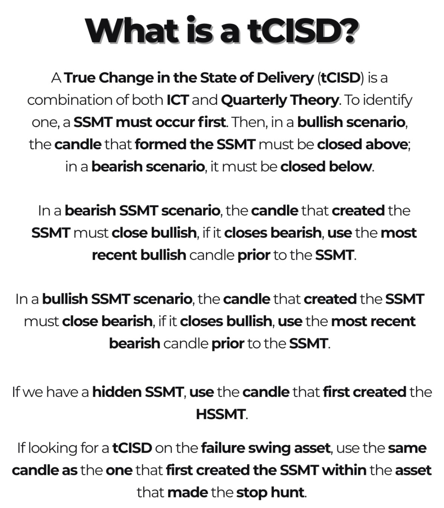
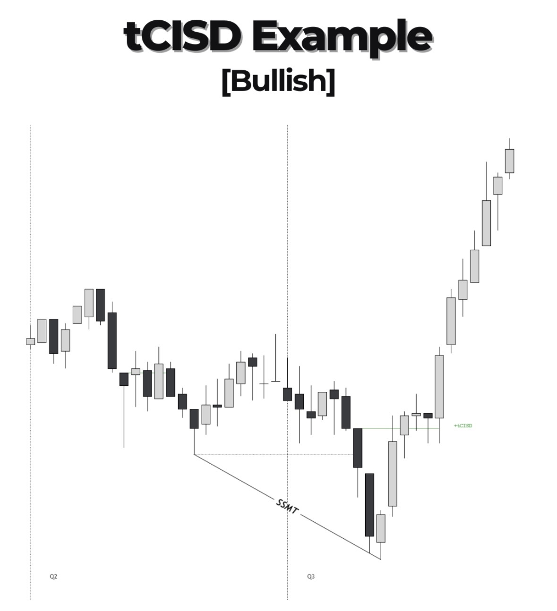
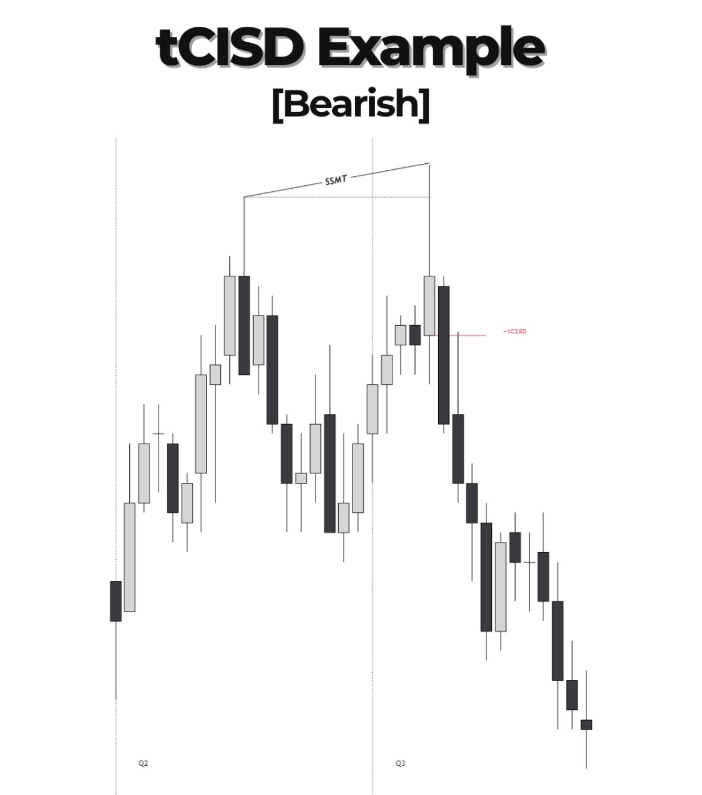

---
tags:
  - knowledge
type:
aliases:
---

# tCISD
<div style="display:flex;gap:8px;">




</div>
## Definition

> A **tCISD** (True Change in the State of Delivery) is a combination of ICT and Quarterly Theory — triggered by a SSMT, confirmed when price closes above (bullish) or below (bearish) the candle that formed the SSMT.

**Prerequisites:** A [[SSMT]] must occur first.

**Candle selection rules:**

| Scenario            | Candle to use                                                                                                                    |
| ------------------- | -------------------------------------------------------------------------------------------------------------------------------- |
| Bearish SSMT        | The SSMT candle **must close bullish** → use it. If it closes bearish, use the most recent **bullish** candle prior to the SSMT. |
| Bullish SSMT        | The SSMT candle **must close bearish** → use it. If it closes bullish, use the most recent **bearish** candle prior to the SSMT. |
| Hidden SSMT (HSSMT) | Use the candle that **first created** the HSSMT.                                                                                 |
| Failure swing asset | Use the same candle that **first created the SSMT** within the asset that made the stop hunt.                                    |

**Confirmation:**
- Bullish tCISD → price **closes above** the selected candle
- Bearish tCISD → price **closes below** the selected candle

## Conditions / How to Identify

- 
- 
- 

## Chart Examples

**Example 1**

**Example 2**

## Notes & Observations

> Personal observations from real trades.

- 

## Related Concepts

- [[]]

---

## Trade Examples

```dataview
TABLE date, narrative, narrative_result
FROM "Daily"
WHERE contains(file.outlinks, this.file.link)
SORT date DESC
```
